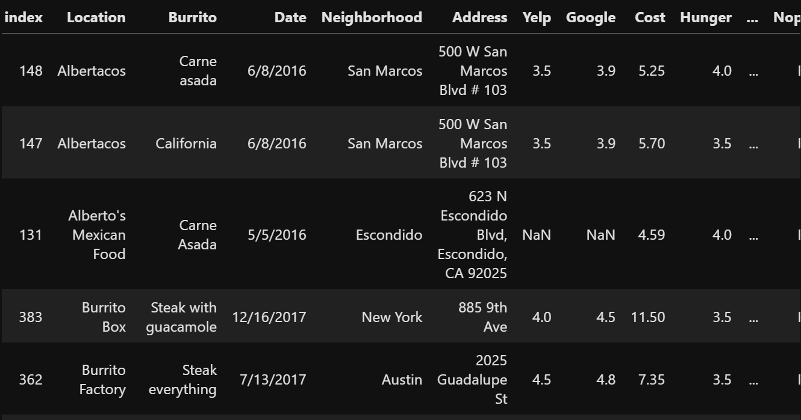
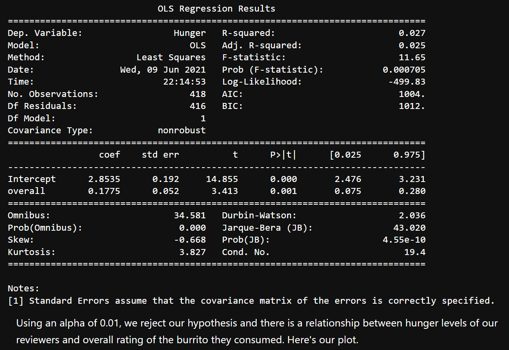
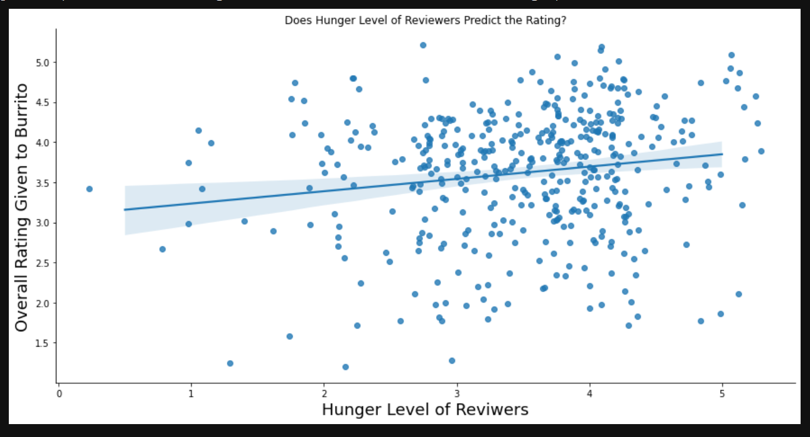
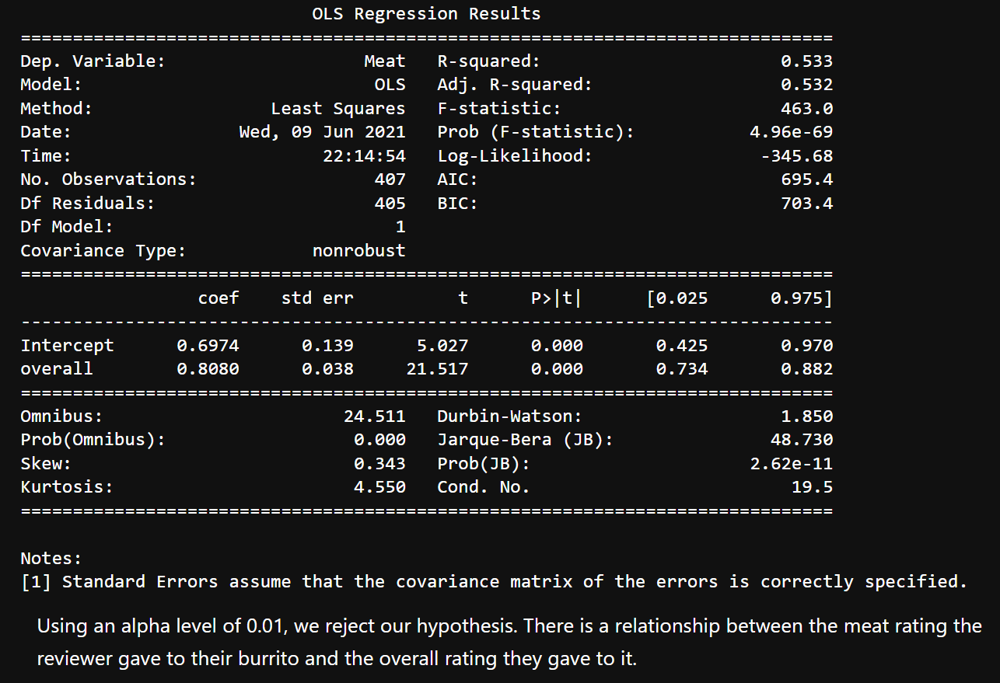
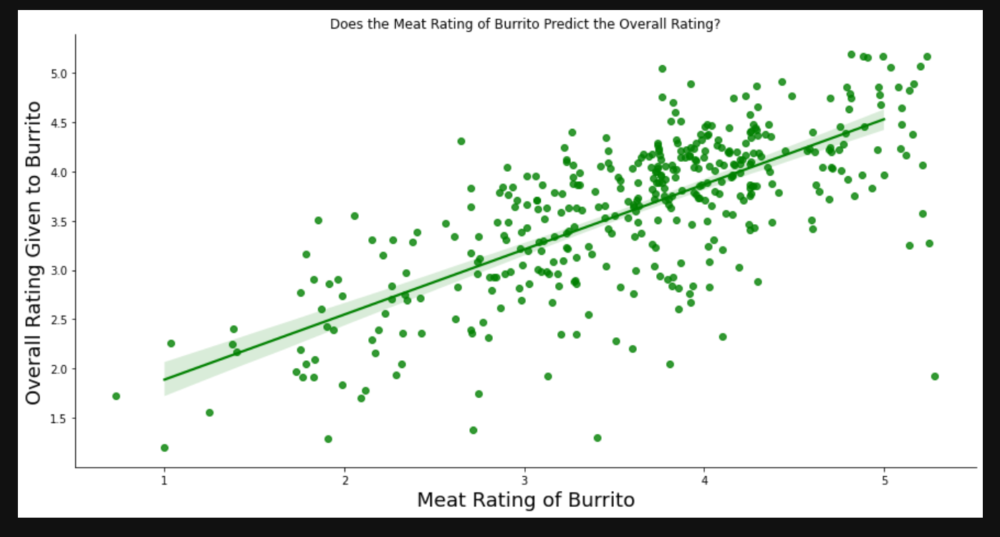
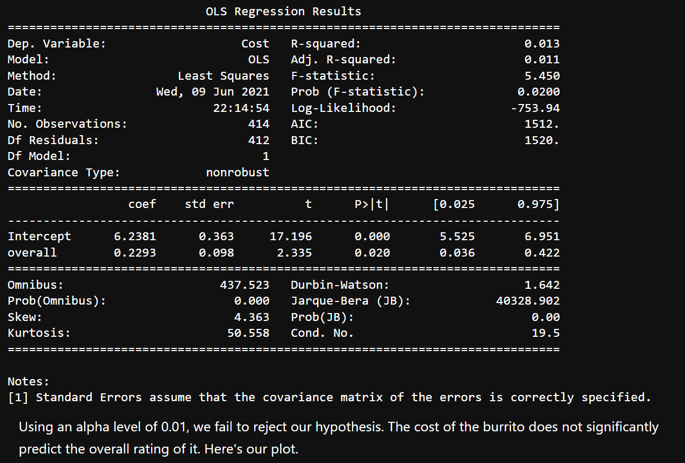
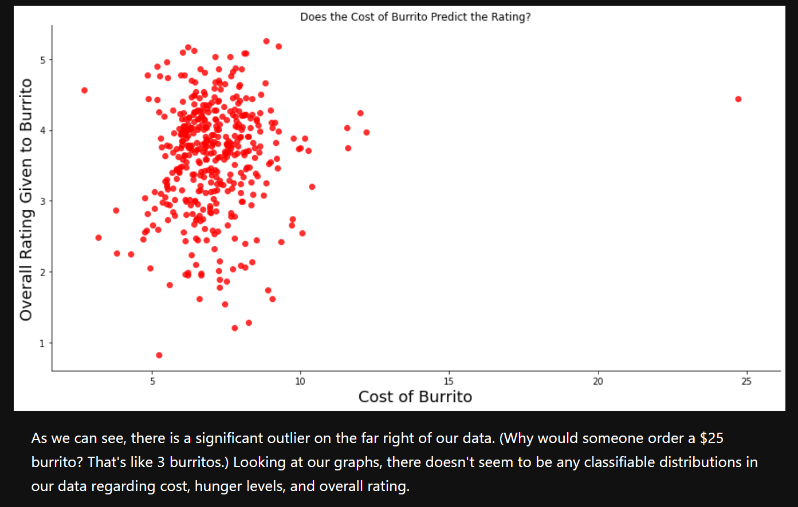

# Burrito-Analysis

## About
This repository contains info related to a group course project I completed at UCSD. I cannot share the source code because the project is related to coursework and sharing could violate academic standards. However, I provide images and project details here. Please feel free to contact me with technical questions or to ask about my collaborators! This project would not be possible without them.

The project features analysis of the [100 Burritos](https://srcole.github.io/100burritos/) dataset by Scott Cole. We set out to find if any of the 'dimensions' of a burrito as defined in the dataset can be used to accurately predict customer satisfaction. In particular, we tested price, filling, and customer hunger level. 

## Project Details
This project was completed in Python through Jupyter Notebook. Some data science libraries we used include pandas, matplotlib, seaborn, numpy, patsy, statsmodels, and scipy. I was in charge of EDA. This involved cleaning the data, formatting it to fit our needs, and performing statistical analysis.

Because our data is comprised of written reviews, the overall scores given for each are subjective and may contribute to some bias. Some variables may be linked to others. We want to see if there are any individual factors that affect a review. We chose linear regression because we wanted to find direct relationships between continuous variables.

## Dataset
Please check the above link for more details on the dataset. Below is an image of some entries in the dataset.

## Results
The results of our analysis are as follows:

Analysis shows that hunger level has a weak positive correlation with overall burrito rating. 

Hunger level regression analysis:

Plot of hunger vs overall rating:

Analysis shows that there is a strong positive correlation between meat rating and overall rating. 

Meat rating regression analysis:

Plot of meat vs overall rating:

Analysis shows that there is little correlation between cost and overall burrito rating. 

Cost regression analysis:

Plot of cost vs overall rating:

